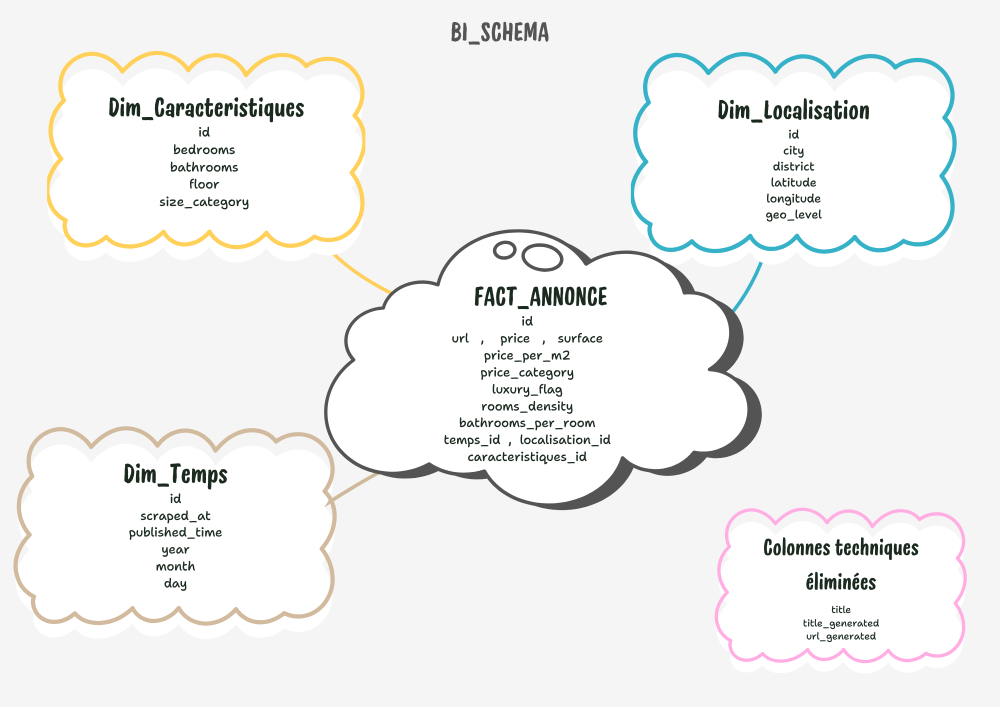
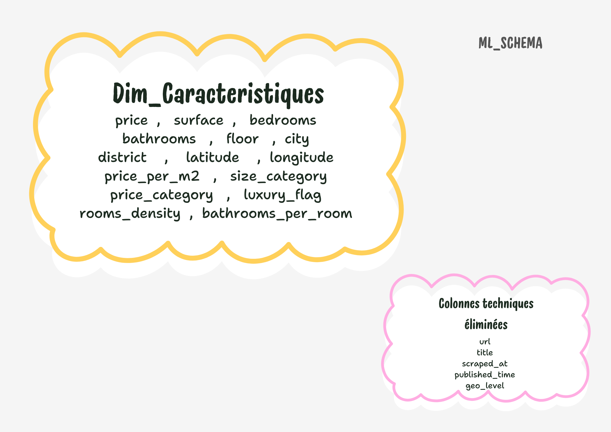

<div align="center">

# Real Estate Data Intelligence Pipeline


<p align="center">
  <a href="#overview">Overview</a> •
  <a href="#system-architecture">Architecture</a> •
  <a href="#advanced-data-strategies">Data Strategies</a> •
  <a href="#docker-deployment-guide">Deployment</a>
</p>

[](https://www.python.org/)
[](https://www.docker.com/)
[](https://www.postgresql.org/)
[](https://github.com/)

---

</div>


This project is a high-performance **End-to-End ETL Pipeline** engineered to automate the lifecycle of real estate data. It transforms raw, unstructured web scraping results into a structured, analytics-ready **Data Warehouse** using a modular and scalable architecture.

> [!IMPORTANT]
> **Container First**: The entire environment is orchestrated via Docker, ensuring seamless deployment and consistency across development and production stages.

---


The pipeline is built on a **Modular ETL Design**, ensuring that each component can be scaled or modified independently.

### 📊 Business Intelligence Layer (Star Schema)
Our BI layer utilizes a optimized Star Schema to provide lightning-fast analytical responses.
<p align="center">
  
</p>

### 🤖 Machine Learning Layer (Feature Store)
Advanced transformations convert raw attributes into high-dimensional features suitable for predictive modeling.
<p align="center">
  
</p>

---


We prioritize **Data Integrity** through a series of logical validation and imputation layers.

| Strategy | Methodology |
| :--- | :--- |
| **Time-Series Imputation** | Midpoint interpolation for `published_time` with logical gap validation. |
| **URL Reconstruction** | Multi-key unique matching to recover missing entry points. |
| **Hierarchical Imputation** | Fallback logic for `price` and `surface` based on local geography. |
| **Dynamic Title Gen** | Semantic construction of property titles based on available attributes. |

---


### 🐳 Run with Docker

1. **Environment Config**
   Create a `.env` file in the root:
   ```env
   DB_USER=postgres
   DB_PASSWORD=charaf
   DB_HOST=postgres
   DB_NAME=avito_dw
   ```

2. **Start Services**
   ```bash
   docker-compose -f docker/docker-compose.yml up --build
   ```

---


This project is designed with **Privacy by Design** principles, ensuring full compliance with **GDPR (RGPD)** standards:

*   **🚫 No PII Collection**: The pipeline strictly extracts property-related data (price, surface, location) and avoids any Personal Identifiable Information (PII) such as names, phone numbers, or personal emails.
*   **🛡️ Data Anonymization**: All listing identifiers are used solely for deduplication and technical processing, ensuring no individual can be re-identified.
*   **🤖 Ethical Scraping**: Integrated delays and localized extraction logic respect the `robots.txt` policies and prevent server overhead on target platforms.

---


```bash
├── 📁 extract/              # Resilient Web Scrapers
├── 📁 clean/                # Logic-based Imputation Layer
├── 📁 Feature_engineering/  # ML-Ready Feature Store
├── 📁 dw/                   # Data Warehouse Loaders
├── 📁 db/                   # SQL Schema Orchestration
├── 📁 staging/              # Local Landing Zone (CSV)
└── 📄 main.py               # Pipeline Entry Point
```

---

<div align="center">

**Developed by Charaf Soubi - Data Analyst**

</div>
